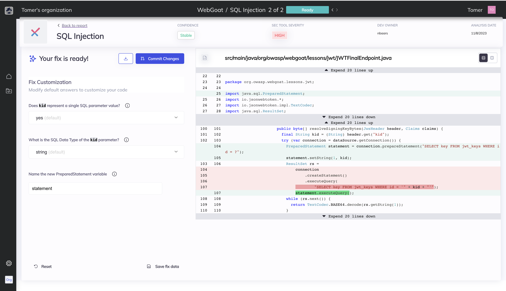

# Bugsy

Bugsy is a command-line interface (CLI) tool that provides automatic security vulnerability remediation for your code. It is the community edition version of [Mobb](https://www.mobb.ai), the first vendor-agnostic automated security vulnerability remediation tool. Bugsy is designed to help developers quickly identify and fix security vulnerabilities in their code.



## What is [Mobb](https://www.mobb.ai)?

[Mobb](https://www.mobb.ai) is the first vendor-agnostic automatic security vulnerability remediation tool. It ingests SAST results from Checkmarx, CodeQL (GitHub Advanced Security), OpenText Fortify, and Snyk and produces code fixes for developers to review and commit to their code.

## What does Bugsy do?

Bugsy has two modes - Scan (no SAST report needed) & Analyze (the user needs to provide a pre-generated SAST report from one of the supported SAST tools).

Scan

- Uses Checkmarx or Snyk CLI tools to run a SAST scan on a given open-source GitHub/GitLab/ADO repo
- Analyzes the vulnerability report to identify issues that can be remediated automatically
- Produces the code fixes and redirects the user to the fix report page on the Mobb platform

Analyze

- Analyzes the a Checkmarx/CodeQL/Fortify/Snyk vulnerability report to identify issues that can be remediated automatically
- Produces the code fixes and redirects the user to the fix report page on the Mobb platform

## Disclaimer

This is a community edition version that only analyzes public GitHub repositories. Analyzing private repositories is allowed for a limited amount of time.
Bugsy does not detect any vulnerabilities in your code, it uses findings detected by the SAST tools mentioned above.

## Usage

You can simply run Bugsy from the command line, using npx:

```shell
npx mobbdev
```

This will show you Bugsy's usage help:

```shell
Bugsy - Trusted, Automatic Vulnerability Fixer 🕵️‍♂️

Usage:
mobbdev <command> [options]


Commands:
  mobbdev scan     Scan your code for vulnerabilities, get automated fixes right away.
  mobbdev analyze  Provide a vulnerability report and relevant code repository, get automated fixes right away.

Options:
  -h, --help  Show help                                                                                        [boolean]

Examples:
  mobbdev scan -r https://github.com/WebGoat/WebGoat  Scan an existing repository

Made with ❤️  by Mobb
```

To run a new SAST scan on a repo and get fixes, run the **Bugsy Scan** command. Example:

```shell
npx mobbdev scan --repo https://github.com/mobb-dev/simple-vulnerable-java-project
```

To get fixes for a pre-generated SAST report, run the **Bugsy Analyze** command. Example:
npx mobbdev analyze --scan-file sast_results.json --repo https://github.com/mobb-dev/simple-vulnerable-java-project

Bugsy will automatically generate a fix for each supported vulnerability identified in the results, and refer the developer to review and commit the fixes to their code.

To see all the options Bugsy allows, use the Scan or Analyze commands with the -h option:

```shell
npx mobbdev scan -h
npx mobbdev analyze -h
```

## Using Bugsy as part of a CI/CD pipeline

If you utilize SAST scans as part of the CI/CD pipeline, Bugsy can be easiy added and provide immediate fix for every issue detected.
Here is a simple example of a command line that will run Bugsy in your pipeline:

```shell
npx mobbdev analyze --ci --scan-file $SAST_RESULTS_FILENAME --repo $CI_PROJECT_URL --ref $CI_COMMIT_REF_NAME --api-key $MOBB_API_KEY
```

## Contribution

Install the dependencies and run the tests:

```shell
pnpm install

# or use npm run build:dev to watch for changes
pnpm run build

# or use npm test:watch to watch for changes
pnpm run test
```

### Debugging

If you're using VSCode, you can use the `launch.json` file to debug the code. Run the `CLI tests` configuration to continuously run and debug the tests.

## Getting support

If you need support using Bugsy or just want to share your thoughts and learn more, you are more than welcome to join our [discord server](https://bit.ly/Mobb-discord)
