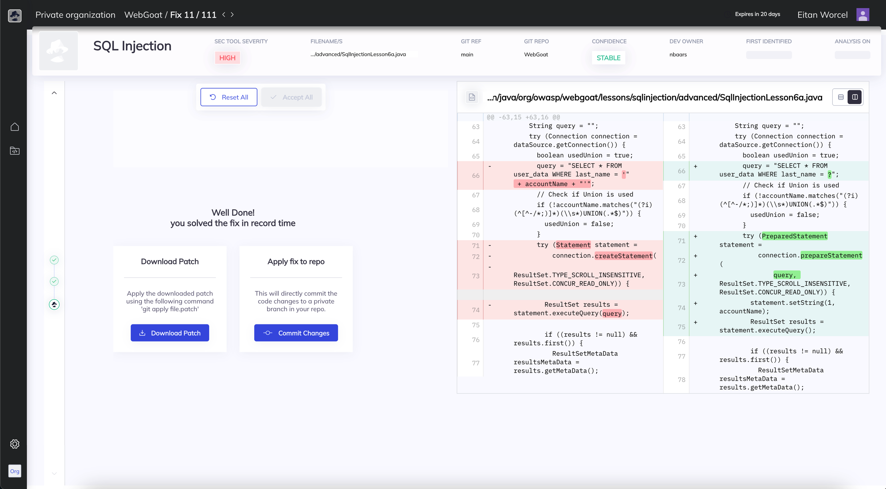

# Bugsy

Bugsy is a command-line interface (CLI) tool that provides automatic security vulnerability remediation for your code. It is the community edition version of [Mobb](https://www.mobb.ai), the first vendor-agnostic automated security vulnerability remediation tool. Bugsy is designed to help developers quickly identify and fix security vulnerabilities in their code.



## What is [Mobb](https://www.mobb.ai)?

[Mobb](https://www.mobb.ai) is the first vendor-agnostic automatic security vulnerability remediation tool. It ingests SAST results from Checkmarx, CodeQL (GitHub Advanced Security), OpenText Fortify, and Snyk and produces code fixes for developers to review and commit to their code.

## What does Bugsy do?

Bugsy has two modes - Analyze (the user has a pre-generated SAST report from one of the supported SAST tools) and Scan (no SAST report needed).

Scan

- Uses Snyk CLI tool to run a SAST analysis on a given open-source GitHub repo
- Analyzes the vulnerability report to identify issues that can be remediated automatically
- Produces the code fixes and redirects the user to the fix report page on the Mobb platform

Analyze

- Analyzes the vulnerability report to identify issues that can be remediated automatically
- Produces the code fixes and redirects the user to the fix report page on the Mobb platform

## Disclaimer

This is a community edition version that only analyzes public GitHub repositories. Analyzing private repositories is allowed for a limited amount of time.
Snyk CLI is used to produce a SAST vulnerability report.

- Only Java and Node.js projects are supported at the moment.

## Usage

You can use Bugsy from the command line. To evaluate and remediate a new open-source repository, you can run the following command:

```shell
npx mobbdev scan -r https://github.com/mobb-dev/simple-vulnerable-java-project
```

Bugsy will automatically generate a fix for each supported vulnerability identified in the SAST results, present it to developers for review and commit to their code.

## Contribution

Install the dependencies and run the tests:

```shell
pnpm install

# or use npm run build:dev to watch for changes
pnpm run build

# or use npm test:watch to watch for changes
pnpm run test
```

### Debugging

If you're using VSCode, you can use the `launch.json` file to debug the code. Run the `CLI tests` configuration to continuously run and debug the tests.

## Getting support

If you need support using Bugsy or just want to share your thoughts and learn more, you are more than welcome to join our [discord server](https://bit.ly/Mobb-discord)
